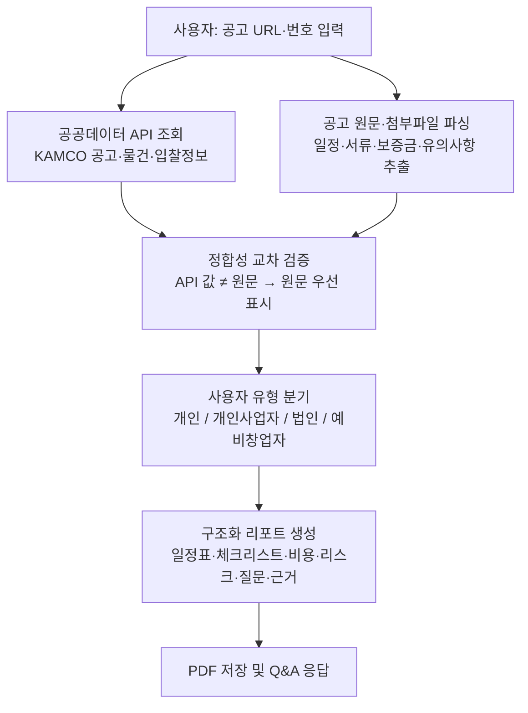
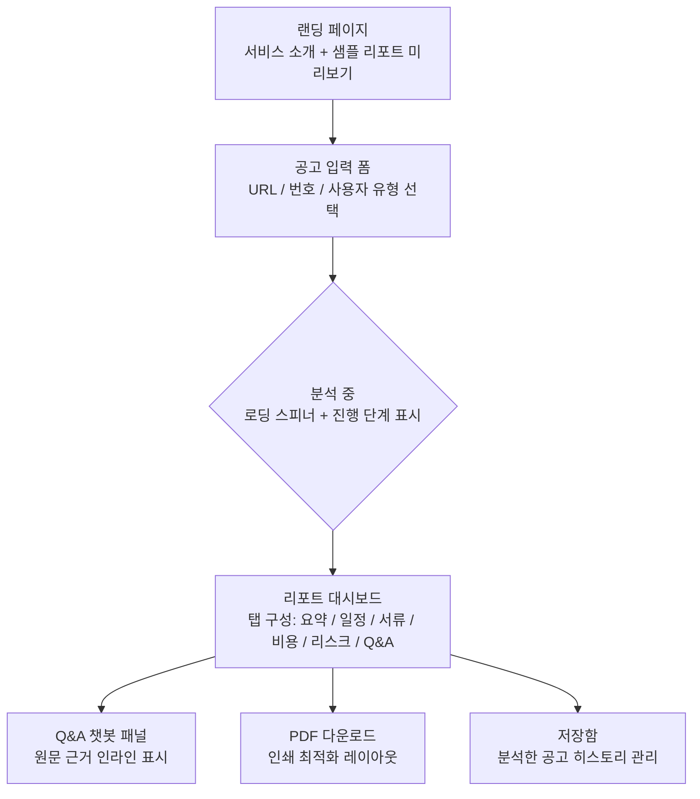
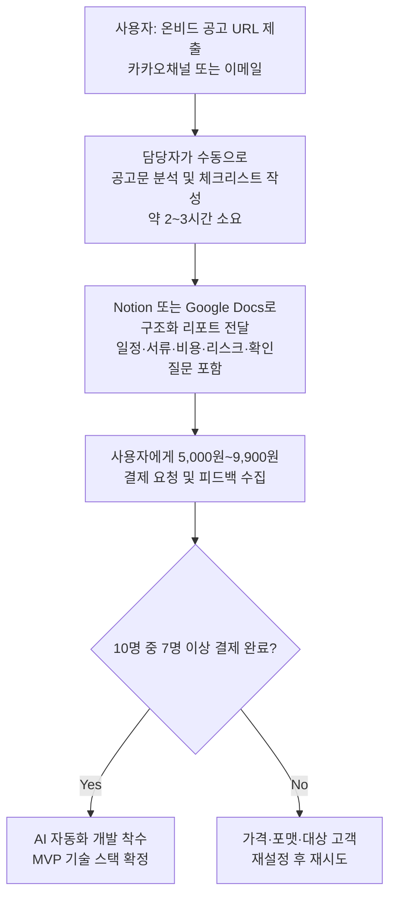

# OnBid Public Asset Doc Agent 사업계획서 (상세버전)

## 1. 핵심 요약 (Executive Summary)

### 서비스 한 줄 요약

> **온비드 공공자산 입찰 공고를 AI가 분석하여, 경험 없는 개인·소상공인도 일정·서류·비용·리스크를 근거와 함께 파악하고 안전하게 입찰을 준비할 수 있도록 돕는 공고 해석 리포트 SaaS.**

---

### 핵심 가치 (어떤 문제를 어떻게 해결하는가)

- **문제**: 온비드 공고를 발견한 이후, 입찰 준비에 필요한 정보(일정·서류·비용·리스크)가 공고문·첨부파일·물건명세 등 수십 페이지에 파편화되어 있어, 경험 없는 개인·소상공인은 핵심 의무와 리스크를 놓치거나 입찰 자체를 포기하게 됨.
- **해결 방식**:
  - 공고 URL·공고번호 입력 → KAMCO 공공데이터 API + 공고 원문을 도메인 특화 AI로 동시 분석
  - 일정표·제출서류 체크리스트·비용 후보·리스크 카드·확인 질문을 **원문 근거와 함께** 구조화
  - 사용자 유형(개인·개인사업자·법인·예비창업자)별 준비 순서와 To-Do 리스트를 차별 제공
  - 최종 판단(입찰 여부·사업성·법률관계)은 사용자가 직접 확인하도록 경계를 명확히 설정 → **AI 과신 리스크 차단**
- **핵심 가치 제안**: *"수 시간의 공고 해석 작업을 수 분으로, 전문가 컨설팅 비용의 1% 미만으로"*



---

### 목표 시장·목표 사용자 수

| 구분 | 내용 |
| :--- | :--- |
| **핵심 타깃 시장** | 국내 공공자산(온비드) 입찰 참여 개인·소상공인 및 이를 지원하는 컨설턴트·창업지원기관 |
| **SAM (유효 시장)** | 연간 약 50억~100억 원 (온비드 연간 입찰 공고 추정 15만 건, 구독자 기준) |
| **SOM (초기 3년 목표)** | 연 매출 3억~5억 원 (유료 리포트 3만 건 + 구독자 500명 수준) |
| **Year 1 사용자 목표** | 누적 가입자 3,000명 / 유료 전환 300명 (전환율 10%) |
| **Year 2 사용자 목표** | 누적 가입자 10,000명 / 월 구독자 800명 / 기관 계약 5건 |
| **Year 3 사용자 목표** | 월 활성 사용자(MAU) 5,000명 / 월 구독자 2,000명 / API·화이트라벨 파트너 3곳 이상 |

**연도별 목표 유료 사용자 수 (명)**

| 항목 | 유료 리포트 구매자 | 월 구독자 | 기관 계약 |
| --- | ---: | ---: | ---: |
| Year 1 | 600 | 300 | 10 |
| Year 2 | 1,800 | 800 | 50 |
| Year 3 | 4,000 | 2,000 | 150 |

---


### 주요 리스크 (Devil's Advocate)

- **AI 환각·법적 책임 리스크**: 잘못된 공고 해석 정보로 입찰 무효·금전 손실 발생 시 법적 분쟁 가능성이 높으며, 면책 조항만으로 완전한 차단이 어려움
- **유료 전환율 과대 추정**: 공공자산 입찰은 비정기적 일회성 수요가 대부분이므로, 건별 구매보다 구독 전환이 어렵고 10% 전환율 가정은 근거가 취약함
- **HWP/PDF 파싱 기술 난이도 과소평가**: 국내 공공기관 문서(HWP·HWPX)의 비정형 구조와 스캔 PDF 혼재로 인해 MVP 8주 일정 내 안정적 파싱 달성이 현실적으로 매우 어려움
- **온비드 공공 API 의존성 집중**: KAMCO API의 구조 변경·서비스 중단 시 핵심 기능 전체가 마비되는 단일 장애점(SPOF) 리스크가 사업 생존과 직결됨
- **TAM·SAM 산정의 자의적 가정**: '연간 공고 15만 건', '유효 참가자 1만 명 구독 가정' 등 핵심 시장 규모 수치에 실증 데이터가 없어 투자자·심사위원 신뢰 확보가 어려움

## 2. 트렌드 (Trend)

### 2.1 시장 트렌드 (Market Trend)

- **공공자산 거래의 꾸준한 시장 형성 및 참여자 유지**
  - 한국자산관리공사(KAMCO)의 온비드는 2008년 이용약관 제정 이후 꾸준히 운영되며 안정적인 공공자산 거래 플랫폼으로 자리매김함 [4].
  - '온비드 월별 입찰참가자 현황' 데이터가 2025년까지 제공될 예정으로, 이는 장기간에 걸쳐 지속적인 입찰 참여자 그룹이 존재함을 시사함 [1]. 이들은 반복적으로 공고를 탐색하고 입찰을 준비하는 핵심 시장 수요층임.

- **정보 접근성에서 '정보 활용 능력'으로의 시장 수요 변화**
  - 정부의 공공데이터 개방 정책으로 온비드 공고 정보 접근성은 높아졌으나, 방대한 비정형 데이터(공고문, 첨부파일)를 해석하고 실행 계획을 수립하는 데 어려움을 느끼는 사용자가 다수 존재함.
  - 이는 소비자가 겪는 불편함, 즉 '페인 포인트(Pain Point)'를 해결하는 서비스에 대한 수요가 발생하고 있음을 의미함 [6]. 시장의 핵심 요구가 단순 '검색'에서 '이해와 준비 자동화'로 이동 중임.

- **GovTech SaaS 시장의 성장 잠재력**
  - 글로벌 SaaS 시장은 2026년 5,122.7억 달러 규모에 이를 것으로 예측되며, B2B SaaS가 성장을 주도하고 있음 [7].
  - 국내에서도 공공데이터를 활용하여 행정 및 입찰 절차의 비효율을 개선하는 GovTech(공공 기술) SaaS 분야의 성장 가능성이 높음. 본 서비스는 이러한 거시 트렌드에 부합함.

- **온비드 활용 데이터 시각화**
  - 온비드에서 거래되는 자산은 부동산, 자동차, 기계장비, 유가증권 등 용도가 다양하며, 이는 '차세대 온비드 용도별 입찰 통계 조회서비스' API를 통해 확인 가능함 [1]. 이는 다양한 유형의 자산에 관심 있는 잠재 고객이 존재함을 보여줌.

**온비드 취급 자산 유형(예시)**

| 항목 | 값 | 비율 |
| --- | ---: | ---: |
| 부동산(토지, 건물 등) | 55 | 55.0% |
| 동산(자동차, 기계 등) | 25 | 25.0% |
| 권리/기타(유가증권 등) | 15 | 15.0% |
| 압류/국유재산 | 5 | 5.0% |

*주: 위 차트는 온비드 API가 제공하는 '용도별' 통계 데이터의 구조를 바탕으로 구성한 예시이며, 실제 비율은 API를 통해 확인 필요 [1].*

### 2.2 기술 트렌드 (Tech Trend)

- **생성형 AI 기반 문서 분석 기술의 상용화**
  - 대규모 언어 모델(LLM)을 활용해 긴 공고문과 첨부 문서의 내용을 요약하고, 핵심 정보를 추출하며, 사용자의 질문에 답변하는 기술이 보편화되고 있음.
  - 이를 통해 복잡한 입찰 문서를 사용자가 처음부터 끝까지 읽지 않아도 핵심 내용을 파악할 수 있는 AI 에이전트 개발이 가능함.

- **RAG(Retrieval-Augmented Generation) 기술을 통한 신뢰성 확보**
  - AI가 생성한 답변의 사실 여부를 검증하기 위해, 원본 문서(공고문)와 정형 데이터(공공데이터 API)를 근거로 제시하는 RAG 기술이 중요해지고 있음.
  - 본 서비스는 이 기술을 적용하여 모든 분석 결과(일정, 비용, 리스크 등)에 대해 원문 근거를 함께 제공함으로써 사용자의 신뢰를 확보하고 최종 판단을 도움.

- **API 결합을 통한 서비스 고도화**
  - 온비드가 제공하는 '차세대 온비드 지역별/용도별 입찰 통계 조회서비스' 등 다양한 Open API [1]를 생성형 AI와 결합할 경우, 단순 문서 분석을 넘어 시장 동향 분석, 경쟁률 예측 등 고부가가치 정보 제공이 가능해짐.
  - 이는 GovTech SaaS가 공공데이터와 민간 AI 기술을 결합하여 새로운 가치를 창출하는 핵심적인 방식임.

---

## 3. 문제 정의 (Problems)

온비드 입찰 경험이 부족한 개인 및 소상공인은 관심 공고를 발견한 후, 실제 입찰 준비 단계에서 다음과 같은 복잡하고 파편화된 프로세스로 인해 어려움을 겪거나 입찰을 포기하게 됨.

```mermaid
graph TD
    A[관심 공고 발견] --> B{공고문/첨부파일 수십 페이지 다운로드};
    B --> C[수동으로 정보 취합<br/>(일정, 서류, 비용, 특수조건 등)];
    C --> D{정보의 파편화 및 누락<br/>- 물건 문의: 매도기관 [5]<br/>- 절차 문의: 캠코 담당자 [5]<br/>- 핵심 리스크 분산};
    D --> E[준비 과정의 혼란 및 시간 지연];
    E --> F[입찰 포기 또는 실수 발생];

```

- **핵심 문제점 구체화**
  - **정보의 과부하 및 파편성**: 하나의 입찰을 위해 공고문, 재산명세, 현장사진, 감정평가서 등 여러 문서를 검토해야 하며, 문의처 또한 물건과 절차에 따라 달라 정보 취합이 번거로움 [5].
  - **높은 해석 난이도**: 법률, 행정, 계약 용어가 많고, '사용자 책임', '인허가 사항' 등 리스크 조항이 여러 문단에 흩어져 있어 비전문가가 핵심 의무와 리스크를 파악하기 어려움.
  - **핵심 정보 누락 리스크**: 입찰보증금, 잔대금 납부 기한, 필수 제출 서류, 부가가치세/보험료 등 추가 비용 항목을 놓쳐 입찰이 무효가 되거나 예상치 못한 지출이 발생할 위험 존재.
  - **과도한 시간 및 기회비용**: 공고 1건을 제대로 분석하는 데 수 시간이 소요되어, 다수의 공고를 검토하고 비교하는 것이 현실적으로 어려워 더 좋은 기회를 놓칠 수 있음.

- **기존 해결 방식의 한계와 본 서비스의 효과성**

| 기존 방식 | 한계점 | **OnBid Public Asset Doc Agent의 해결책** |
| :--- | :--- | :--- |
| **온비드 직접 탐색/분석** | 공고 탐색만 가능할 뿐, 일정, 서류, 비용, 리스크 등은 사용자가 직접 해석하고 구조화해야 하는 부담 존재. | **AI 기반 자동 구조화**: 공고 URL 입력 즉시 AI가 원문과 공공데이터를 분석하여 일정, 서류, 비용, 리스크를 표준화된 구조로 정리 및 제공. |
| **범용 LLM (ChatGPT 등)** | 최신 온비드 공고 데이터 및 API와 실시간 연동이 어렵고, 법률/행정 용어 해석에 오류(환각)가 발생할 수 있으며, 답변의 근거를 확인하기 어려움. | **RAG 및 근거 제시**: 온비드 원문과 공공데이터 API [1]에 기반한 답변을 생성하고, 모든 정보에 원문 출처를 명시하여 사용자가 직접 검증 가능. |
| **전문가 컨설팅** | 건당 수십만 원의 높은 비용으로 인해, 소액 물건을 탐색하는 개인이나 소상공인에게는 부담이 큼. | **합리적 비용의 SaaS**: 건당 수천 원 또는 월 구독료 모델로 제공하여, 여러 공고를 부담 없이 검토하고 비교 분석할 수 있는 환경 제공. |

---

## 4. 솔루션 (Solution)

### 만들려는 것 (서비스·제품 개요)

- **OnBid Public Asset Doc Agent**: 온비드 공고 URL·번호를 입력하면, KAMCO 공공데이터 API와 공고 원문을 AI가 연동 분석하여 **입찰 준비 전용 구조화 리포트**를 즉시 생성하는 웹 기반 SaaS
- 온비드 공식 입찰 절차·법적 판단·사업성 예측을 대체하지 않으며, 사용자가 담당기관·전문가에게 **무엇을 확인해야 하는지**를 명확히 안내하는 역할에 집중
- 초기 MVP는 웹 UI 기반 단일 공고 분석에 집중하고, 이후 구독·기관용·API로 단계적 확장

---

### 핵심 기능 목록 (구체적)

#### 기능 1. 공고 입력 및 공공데이터 조회
- 입력값: 공고 URL, 공고관리번호, 물건관리번호, 사용자 유형(개인/개인사업자/법인/예비창업자), 관심 목적(매입/임차/창업 거점 등)
- KAMCO 온비드 Open API 연동: 공고목록, 공고상세, 물건정보, 입찰정보, 입찰결과, 용어사전 6개 엔드포인트 호출
- API 응답 필드를 표준 입력 스키마(JSON)로 정규화하여 AI 분석 레이어로 전달
- MVP 단계: 정적 샘플 JSON 캐시로 API 연동 없이 기능 흐름 검증

#### 기능 2. 공고 구조화 및 원문 정합성 체크
- 공고문(PDF·HWP·HWPX) 및 첨부파일 텍스트 파싱
- 추출 항목: 입찰 일정(공고일·입찰기간·개찰일·납부기한), 제출서류 목록, 입찰보증금·잔대금·추가 비용, 낙찰 후 의무(계약 기한·명도 책임 등), 유의사항·특약 조항
- API 값과 원문 값 불일치 시 **"원문 우선 확인 필요"** 배지 자동 표시 → 인적 오류(Human Error) 차단
- 온비드 용어사전 API 연동으로 법률·행정 용어 인라인 자동 해설

#### 기능 3. 사용자 유형별 체크리스트 및 준비 순서
- 개인·개인사업자·법인·예비창업자 4개 유형 분기 로직
- 각 유형별 필수 제출서류(주민등록등본, 사업자등록증, 법인인감증명서 등) 자동 선별
- 서류 제출 방식(온라인/오프라인), 제출 플랫폼(온비드 전자입찰/방문), 마감 시간 명시
- 준비 단계별 순서: **D-Day 역산 To-Do 타임라인** 형태로 제공 (입찰 마감일 기준 역산)

#### 기능 4. 비용 후보 카드
- 비용 항목 표준화: 입찰보증금·낙찰대금·잔대금·부가가치세·국세·지방세·보증보험료·물품대부료·사용료 등
- 공고 원문에서 확인된 항목 vs. 확인 필요 항목을 색상으로 구분 표시
- 합계 예상 비용 범위(최소~최대) 요약 카드 제공 (단, 추정 표시, 원문 확인 권고)

#### 기능 5. 리스크 카드 및 확인 질문 자동 생성
- AI가 식별하는 리스크 유형: 명도 책임, 현장 미확인, 인허가 필요 여부, 임차인 권리관계, 낙찰 후 계약 기한 초과 시 불이익, 영업수익 미보장, 유관기관 허가사항
- 각 리스크를 **"매도기관에게 확인할 질문"** + **"캠코 담당자에게 확인할 질문"** 으로 분리 생성
- 낙찰 가능성·수익률 예측 금지: 리스크 가이드는 제공하되, 투자 추천은 명시적으로 배제

#### 기능 6. 근거 기반 Q&A (챗봇 인터페이스)
- 사용자 자연어 질문 → 공고 원문 및 공공데이터 청크를 RAG(검색 증강 생성)로 검색 → 원문 근거(페이지·조항)와 함께 답변 생성
- 예시 질문: "제일 먼저 확인할 게 뭔가요?", "보증금은 얼마인가요?", "개인도 입찰 가능한가요?"
- 근거 없는 답변은 "공고 원문에서 확인되지 않음" 으로 명시하여 환각 차단

#### 기능 7. PDF 리포트 생성 및 저장
- 리포트 구성: 공고 한 줄 요약 → 핵심 조건 카드 → 일정표 → 제출서류 체크리스트 → 비용 후보 → 리스크 카드 → 확인 질문 목록 → 용어 설명 → 원문 근거 인용
- 출력 포맷: HTML 인쇄 / PDF 다운로드 (MVP), HWPX 확장 (Phase 2)
- 리포트 내 면책 고지 고정 삽입: "본 리포트는 공고 이해 보조 목적이며, 법적 효력 및 투자 판단의 근거로 사용할 수 없습니다."

---

### UI/UX·제공 형태 요약



| UI 원칙 | 상세 내용 |
| :--- | :--- |
| **입문자 친화적 언어** | 법률·행정 용어에 인라인 툴팁(용어사전 연동) 자동 표시 |
| **진행 상태 투명성** | 분석 중 단계(데이터 조회 → 원문 파싱 → 정합성 체크 → 리포트 생성) 프로그레스 바 표시 |
| **근거 추적 가능성** | 모든 항목에 "원문 보기" 버튼 → 공고 원문 해당 구절 하이라이트 이동 |
| **경계 메시지 명확화** | 리스크 카드·비용 추정값에 "담당기관 확인 필요" 배지 필수 표시 |
| **반응형 웹** | 모바일·태블릿·데스크톱 모두 지원 (Next.js 기반) |
| **제공 형태** | 웹 서비스(SaaS) / PDF 다운로드 / 추후 Slack·이메일 알림 연동 |

---

## 5. 경쟁 분석 (Competitive Analysis)

- **기존 방법 및 대체재 분석**
  - 본 서비스의 직접적인 경쟁, 즉 온비드 공고 분석에 특화된 AI SaaS는 현재 시장에서 명확히 확인되지 않음. 따라서 사용자들이 현재 문제를 해결하기 위해 사용하는 '대체재(Substitutes)'를 주요 경쟁 대상으로 정의함.

- **각 대안의 단점 분석**
  1.  **온비드 직접 검색 및 수동 분석**: 사용자가 모든 정보를 직접 취합, 해석, 구조화해야 함. 법률/행정 용어에 대한 전문 지식이 없을 경우 핵심 리스크(특약, 추가 비용 등)를 놓칠 가능성이 높으며, 공고 1건 분석에 절대적인 시간이 과도하게 소요되어 다수 공고 비교 검토가 어려움.
  2.  **범용 LLM/문서 요약 도구 (ChatGPT, Claude 등)**: 온비드 공고문의 특정 양식이나 최신 공공데이터 API 구조를 이해하지 못함. 결과적으로 핵심 정보를 누락하거나 부정확한 정보(환각)를 생성할 위험이 있음. 특히, 생성된 정보의 원문 근거를 확인하기 어려워 최종 의사결정에 활용하기에는 신뢰도가 부족함.
  3.  **전문가 컨설팅/입찰 대행 서비스**: 건당 수십만 원에서 수백만 원에 이르는 높은 비용은 소액 물건에 입찰하려는 개인 및 소상공인에게 큰 진입장벽임. 또한, 즉각적인 분석이 아닌 의뢰 및 대기 시간이 필요하며, 여러 공고를 저비용으로 빠르게 스크리닝하려는 초기 탐색 단계에는 적합하지 않음.

- **주요 경쟁 대안 비교표**

| 구분 | **자사: OnBid Public Asset Doc Agent** | **대체재 A: 온비드 직접 분석** | **대체재 B: 범용 AI/문서 요약** | **대체재 C: 전문가 컨설팅/대행** |
| :--- | :--- | :--- | :--- | :--- |
| **핵심 기능** | 도메인 특화 AI 기반 공고 분석 리포트, 실행 체크리스트, 리스크 분석 | 공고 검색, 원문 열람 | 일반 텍스트 요약 및 Q&A | 맞춤형 컨설팅, 입찰 서류 작성 및 제출 대행 |
| **정보 정확성** | API 및 원문 교차검증을 통한 높은 신뢰도, 모든 정보에 근거 제시 | 사용자의 전문성에 따라 편차 큼, 인적 오류(Human Error) 발생 가능 | 낮음 (환각 현상, 소스 불분명) | 매우 높음 |
| **비용** | 건당 3천~9천원 / 월 1.9만~4.9만원 | 무료 | 무료 또는 월 2~3만원 | 건당 수십만원 ~ 수백만원 |
| **속도/접근성** | 즉시 (수 분 내 리포트 생성) | 느림 (수 시간 소요) | 매우 빠름 | 느림 (의뢰 후 수 일 소요) |
| **대상 고객** | 입찰 초보자, 소상공인, 다수 공고를 검토하는 실무자 | 입찰 경험이 풍부한 전문가 | 일반 사용자 | 고액 자산 입찰자, 법인 |
| **핵심 단점** | 초기 서비스는 분석 가능한 공고 유형 제한 가능성 | 시간/노력 과다 소요, 리스크 누락 위험 높음 | 온비드 데이터 특화 분석 불가, 신뢰도 문제 | 높은 비용, 소액 물건에 부적합 |

**경쟁 포지셔닝 맵**

| 항목 | 비용 효율성 (저비용 → 고비용) | 분석 정확성 및 구조화 수준 (낮음 → 높음) |
| --- | ---: | ---: |
| 범용 AI | 0.1 | 0.3 |
| 온비드 직접 분석 | 0.2 | 0.4 |
| OnBid Public Asset Doc Agent | 0.3 | 0.85 |
| 전문가 컨설팅 | 0.9 | 0.9 |

*주: X축은 비용의 역수를 의미하며, 오른쪽으로 갈수록 비용이 높고 효율성은 낮아짐.*

---

## 6. 차별화 (Differentiator)

- **핵심 차별성**: 본 서비스는 파편화된 공공데이터와 비정형 텍스트(공고문)를 '도메인 특화 AI'로 연결하고, 입찰 준비라는 '실행 가능한(Actionable)' 형태로 구조화하여 제공하는 국내 유일의 솔루션임. 단순 정보 요약을 넘어, 사용자의 안전한 입찰 준비 과정을 돕는 'AI 보조 에이전트' 역할을 수행함.

- **기존 솔루션 한계 극복 방안**
  - **정확성 및 신뢰성 확보**: 범용 AI가 가지는 환각 문제를 RAG(검색 증강 생성) 기술과 온비드 공공데이터 API 실시간 연동으로 해결함. 모든 분석 결과(일정, 비용, 제출서류 등)에 대해 공고문 원문 내용과 조항 번호를 근거로 제시하여 사용자가 직접 검증할 수 있도록 함으로써, '믿을 수 없는 AI'의 한계를 극복.
  - **압도적인 시간 및 비용 효율성**: 전문가 컨설팅 대비 1% 미만의 비용(건당 수천 원)으로, 수 시간 걸리는 수동 분석 작업을 수 분 내에 완료함. 이를 통해 사용자는 여러 유망 공고를 시간과 비용 부담 없이 비교, 검토하여 더 나은 투자 기회를 포착할 수 있음.

- **차별화 포인트 도표**

| 차별화 포인트 | 상세 설명 | 기존 대안의 한계 극복 |
| :--- | :--- | :--- |
| **1. 도메인 특화 AI 분석 엔진** | 온비드 공고문, 재산명세, 관련 법규 등 입찰 관련 문서의 구조와 용어를 학습한 AI 모델. 핵심 조항(보증금, 잔금, 명도 책임 등)을 정확히 식별 및 추출. | **[범용 AI 한계 극복]** 일반 문서 요약이 아닌, 입찰의 맥락을 이해하는 분석으로 정보 누락 및 오해석 방지. |
| **2. 데이터 교차검증 기반 신뢰성 확보** | 공고문 텍스트(비정형)와 온비드 API 데이터(정형)를 상호 비교 검증하여 정보의 일관성과 정확성을 높임. 모든 결과에 원문 근거(페이지, 조항)를 명시. | **[수동 분석 한계 극복]** 사용자가 놓치기 쉬운 불일치나 중요 정보를 시스템이 자동으로 확인하여 인적 오류(Human Error) 최소화. |
| **3. 사용자 유형별 실행 계획 제공** | 개인, 소상공인, 컨설턴트 등 사용자 유형에 따라 차별화된 체크리스트와 준비 순서를 가이드. '무엇을, 언제까지, 어떻게' 해야 하는지 명확히 제시. | **[정보의 파편성 극복]** 방대한 정보 속에서 헤매지 않도록 개인화된 To-Do List를 제공하여, 정보 탐색이 아닌 '실행'에 집중하게 함. |
| **4. 리스크 사전 식별 및 질문 생성** | 명도 책임, 인허가 사항, 추가 발생 가능 비용 등 잠재적 리스크 조항을 AI가 식별하고, 해당 리스크에 대해 매도기관/담당자에게 문의해야 할 핵심 질문 목록을 자동으로 생성. | **[입찰 초보자 한계 극복]** 경험 부족으로 인해 무엇을 물어봐야 할지 모르는 상황을 방지하고, 근거 기반의 안전한 입찰을 지원. |

---

## 7. 플랫폼 전략 (Platform Strategy)

- **솔루션의 성공적인 시장 안착 후, 사용자 규모와 축적된 데이터를 기반으로 다음과 같은 3단계 확장 전략을 추진하여 지속 가능한 성장 동력을 확보하고 플랫폼으로 진화함.**

```mermaid
graph TD
    subgraph Phase 1 [코어 기능 강화 및 시장 침투]
        A[Onbid 공고 분석 고도화] --> B[낙찰가율/경쟁률 예측 모델 개발];
        B --> C[사용자 피드백 기반 체크리스트/리스크 DB 확장];
    end

    subgraph Phase 2 [서비스 영역 수평 확장]
        D[분석 대상 플랫폼 확대] --> E[나라장터(G2B)];
        D --> F[법원경매정보];
        D --> G[LH/SH 등 공기업 입찰];
    end

    subgraph Phase 3 [생태계 구축 및 B2B 확장]
        H[API/White-Label 제공] --> I[프롭테크/금융기관 연동];
        H --> J[부동산/창업 컨설팅 솔루션];
        K[전문가 네트워크] --> L[AI 분석 기반 전문가 매칭/자문 연계];
    end

    A --> D;
    D --> H;
    D --> K;

```

- **Phase 1: 핵심 기능 고도화 (Core Feature Enhancement & Market Penetration)**
  - **입찰 데이터 기반 예측 모델 개발**: 축적된 공고 및 낙찰 데이터를 활용하여 유사 물건의 예상 낙찰가율, 경쟁률 등 예측 정보를 제공하여 사용자의 입찰가 산정 의사결정을 지원.
  - **서류 자동화**: 공고 분석 리포트를 기반으로 입찰신청서, 계약서 초안 등 반복적인 서류의 주요 항목을 자동으로 채워주는 기능 개발.
  - **커뮤니티 기능**: 특정 공고에 대한 사용자들의 Q&A, 정보 공유, 공동 투자 파트너 탐색 등을 위한 커뮤니티를 구축하여 플랫폼 락인(Lock-in) 효과 강화.

- **Phase 2: 서비스 범위의 수평적 확장 (Horizontal Service Expansion)**
  - **분석 대상 플랫폼 다각화**: OnBid 분석 엔진의 구조를 모듈화하여, '나라장터(G2B)', '대한민국 법원경매정보', 'LH/SH 등 주요 공기업'의 입찰 공고 시스템으로 분석 대상을 확장. 이를 통해 TAM(전체 시장)을 수배 이상으로 확대.
  - **분석 자산 유형 확장**: 부동산 중심에서 나아가 기계장비, 차량, 지식재산권 등 동산 및 권리 입찰 공고 분석 기능으로 확장하여 다양한 분야의 사업자 고객 유치.

- **Phase 3: 플랫폼 생태계 구축 및 B2B 사업화 (Ecosystem Building & B2B Monetization)**
  - **API 및 화이트라벨(White-Label) 솔루션 제공**:
    - **금융/보험사**: 분석된 자산의 가치와 리스크 정보를 대출 심사(LTV 산정), MCI(모기지신용보험) 상품 개발 등에 활용할 수 있도록 데이터 API 제공.
    - **프롭테크/자산관리 앱**: 기존 서비스 내에 '공공자산 입찰 정보 분석' 기능을 손쉽게 탑재할 수 있는 화이트라벨 솔루션 제공.
    - **컨설팅/창업지원 기관**: 다수의 공고를 관리하고 고객에게 리포트를 제공해야 하는 전문가/기관을 위한 B2B SaaS 대시보드 제공.
  - **전문가 네트워크 연계**: AI 분석 리포트만으로 해결되지 않는 심층적인 법률/세무/행정 자문이 필요할 경우, 플랫폼 내에서 검증된 전문가(변호사, 세무사, 행정사 등)와 연결하고 자문료의 일부를 수수료로 취하는 모델 도입. 이를 통해 경쟁 관계에 있던 전문가 그룹을 파트너로 전환.

---

## 8. 시장 정의·규모 (Market Definition & TAM)

- **시장 정의**: 온비드를 통해 공공자산(부동산, 동산 등) 입찰에 참여하고자 하나, 복잡한 공고문 해석과 입찰 준비 절차에 어려움을 겪는 **개인 및 소규모 사업자**를 핵심 타깃으로 하는 **'공공 조달/입찰 문서 분석 SaaS' 시장**으로 정의함.
  - **주요 고객 세그먼트**:
    - 온비드 입찰 경험이 적은 개인 투자자 및 실수요자
    - 공공자산 임대/매입을 통한 예비 창업자 및 소상공인
    - 다수 공고를 검토해야 하는 부동산 컨설턴트 및 창업지원기관 담당자

- **TAM (Total Addressable Market, 전체 시장)**: 본 서비스가 속한 국내 B2B SaaS 시장.
  - 글로벌 SaaS 시장은 2026년 5,122.7억 달러에 이를 전망 [7].
  - 글로벌 시장에서 한국의 B2B 시장 점유율을 약 1.5%로 가정할 시 [8], 국내 B2B SaaS 시장의 잠재적 규모는 **약 10조 원**으로 추산 가능.
  - `계산: $5,122.7억 × 1.5% × 1,300원/$ ≒ 10조 원`

- **SAM (Serviceable Addressable Market, 유효 시장)**: 국내 B2B SaaS 시장 중, 공공데이터(입찰, 조달, 계약 등) 기반 문서 분석 및 행정 지원에 대한 수요가 있는 시장.
  - 온비드의 연간 입찰 공고 건수(업계 추정치: 약 15만 건)와 월평균 유효 입찰참가자 수 [1]를 기반으로 추정.
  - 1개 공고 분석 리포트 가치를 5,000원으로 가정하고, 연간 공고의 10%가 분석 대상이 된다면 약 7.5억 원의 시장 형성.
  - 구독 모델(평균 30,000원/월)을 사용하는 활성 사용자(입찰 참여자, 컨설턴트 등) 1만 명을 가정할 경우, 연간 약 36억 원의 시장 규모 추정 가능.
  - 이를 종합하여, 본 서비스가 직접적으로 공략할 수 있는 유효 시장 규모는 **연간 약 50억 ~ 100억 원**으로 추정.

- **SOM (Serviceable Obtainable Market, 초기 점유 목표 시장)**: 서비스 출시 초기 3년간 현실적으로 확보 가능한 시장.
  - 핵심 타깃인 '온비드 입찰 경험 1년 미만의 개인 및 소상공인' 시장에 집중.
  - SAM 100억 원 중, 초기 시장 침투율 3~5%를 목표로 설정.
  - **초기 3년 내 연 매출 3억 ~ 5억 원** 달성을 목표로 하며, 이는 유료 리포트 3만 건(건당 5,000원) 및 구독자 500명(월 25,000원) 수준에 해당.

- **성장 가능성**:
  - **시장 확장성**: 온비드 외 나라장터, 각 지자체 및 공공기관의 자체 입찰/공매 시스템으로 분석 대상을 확장하여 SAM을 확대할 수 있음.
  - **기술적 확장성**: 생성형 AI 및 에이전트 기술의 발전(2.2 기술 트렌드)에 따라, 단순 문서 분석을 넘어 입찰 서류 자동 생성, 계약서 독소조항 검토, 유사 물건 낙찰가 분석 등 고부가가치 서비스로 발전 가능.
  - **정책적 기회**: 정부의 공공데이터 개방 정책(2.1 시장 트렌드)이 지속될수록 분석 가능한 데이터의 종류와 양이 증가하여, 서비스의 정확성과 가치를 지속적으로 높일 수 있는 선순환 구조 구축 가능.

---

## 9. 로드맵 (Roadmap)

### 전체 로드맵 개요

**단계별 개발 기간 및 주요 산출물**

| 항목 | 기간(주) |
| --- | ---: |
| Phase 1: MVP | 8 |
| Phase 2: 정식 출시 | 12 |
| Phase 3: 확장·B2B | 16 |

---

### Phase 1: MVP 개발 및 내부 검증 (0~8주)

- **목표**: 핵심 가치 가설 검증 — "AI 분석 리포트가 수작업 체크리스트 대비 정확성·시간 효율에서 유의미한 우위를 보이는가"
- **대략적 시기**: 착수 후 ~2개월
- **핵심 마일스톤**:
  - **Week 2**: 샘플 온비드 공고 5건 표준 JSON 스키마 정의 및 수작업 정답지 작성 완료
  - **Week 4**: 공고 구조화 파이프라인 구현 — 파싱 → 정합성 체크 → 체크리스트·비용·리스크 출력
  - **Week 6**: 웹 UI MVP (공고 입력 폼 + 리포트 대시보드 + PDF 저장) 완성
  - **Week 8**: 샘플 공고 5건 수작업 정답지와 항목 일치율 비교 → **핵심 항목(일정·서류·보증금) 90% 이상** 목표
- **주요 산출물**:
  - 표준 입력 스키마 (JSON)
  - 공고 파싱 + 체크리스트 생성 AI 에이전트 (오프라인 캐시 기반)
  - 웹 리포트 화면 (Next.js)
  - PDF 저장 기능
  - 내부 검증 보고서 (항목 일치율, 오류 유형 분류)
- **제약 조건**:
  - MVP 단계에서는 KAMCO API 실시간 연동 없이 정적 캐시 데이터 사용
  - 분석 가능 공고 유형: 부동산(토지·건물) 2종에 한정
  - Q&A 챗봇 미포함 (Phase 2로 이관)

---

### Phase 2: 정식 출시 및 초기 시장 침투 (9~20주)

- **목표**: 유료 사용자 확보 및 제품-시장 적합성(PMF) 검증
- **대략적 시기**: 착수 후 2~5개월
- **핵심 마일스톤**:
  - **Week 10**: KAMCO 온비드 API 6개 엔드포인트 실시간 연동 완료
  - **Week 12**: 사용자 유형 4종 분기 체크리스트 + 리스크 카드 + 확인 질문 생성 기능 배포
  - **Week 14**: RAG 기반 Q&A 챗봇 (원문 근거 인라인 표시) 배포
  - **Week 16**: 결제 시스템 연동 (건별 3,000원~9,900원 / 월 구독 19,000원~49,000원)
  - **Week 18**: 오픈 베타 출시 — 초기 사용자 100명 모집 (창업지원기관·소상공인 커뮤니티 채널 활용)
  - **Week 20**: 베타 피드백 반영 1차 업데이트 + 랜딩 페이지 최적화
- **주요 산출물**:
  - KAMCO API 실시간 연동 모듈
  - 사용자 유형별 체크리스트 분기 엔진
  - RAG 기반 Q&A 챗봇
  - 결제·구독 관리 시스템
  - 오픈 베타 서비스 URL
  - 사용자 인터뷰 보고서 (10명 이상)
- **성공 지표 (KPI)**:
  - 베타 기간 유료 전환율 **10% 이상**
  - 리포트 생성 후 PDF 다운로드율 **60% 이상**
  - 사용자 NPS(순추천지수) **+30 이상**

---

### Phase 3: 기능 고도화·플랫폼 확장·B2B 사업화 (21~36주)

- **목표**: MAU 5,000명 달성, 기관 계약 5건, API/화이트라벨 파트너 1건
- **대략적 시기**: 착수 후 5~9개월
- **핵심 마일스톤**:
  - **Week 22**: 분석 가능 자산 유형 확장 — 동산(차량·기계), 권리(유가증권) 추가
  - **Week 24**: 전문가·기관용 패키지(월 99,000원 이상) — 다중 공고 관리 대시보드, 리포트 일괄 생성
  - **Week 26**: 낙찰가율·경쟁률 예측 모델 v1 배포 (축적 데이터 기반)
  - **Week 28**: 나라장터(G2B) 공고 분석 기능 확장 (분석 엔진 모듈화 적용)
  - **Week 32**: API 제공 (화이트라벨 파트너 대상) — 프롭테크·창업지원 플랫폼 연동
  - **Week 36**: HWPX 리포트 출력, 전문가 매칭 연계(변호사·세무사·행정사) 기능 베타
- **주요 산출물**:
  - 멀티 자산 유형 분석 엔진
  - 기관용 B2B 대시보드
  - 예측 모델 v1
  - 나라장터 분석 모듈
  - API 문서 및 화이트라벨 패키지
  - 전문가 매칭 기능 베타

---

## 10. 상세 프로젝트 계획 (Detail Project Plan)

> **전제**: 소규모 팀(기획 1인, 개발 1~2인, AI 1인) 기준 / AI 코딩 도구(GitHub Copilot, Cursor 등) 적극 활용하여 개발 태스크 기간을 표준 대비 **30~40% 단축** 적용

---

### Phase 1 상세 계획 (Week 1~8)

| # | 태스크 | 담당 | 시작 | 종료 | 의존 관계 | 산출물 |
| :---: | :--- | :---: | :---: | :---: | :--- | :--- |
| 1.1 | 샘플 온비드 공고 5건 수집 및 수작업 정답지 작성 | 기획 | W1 | W2 | - | 정답지 Excel (5건) |
| 1.2 | 표준 입력 스키마 설계 (공고·물건·입찰 JSON 구조 정의) | 기획+AI | W1 | W2 | 1.1 | schema.json v1 |
| 1.3 | 공고문 파서 구현 (PDF/HWP 텍스트 추출, 섹션 분리) | 개발+AI | W2 | W4 | 1.2 | parser 모듈 |
| 1.4 | 핵심 항목 추출 AI 에이전트 구현 (일정·서류·보증금·유의사항) | AI | W3 | W5 | 1.3 | extraction agent v1 |
| 1.5 | 정합성 체크 로직 구현 (API 값 vs. 원문 불일치 감지) | AI+개발 | W4 | W5 | 1.4 | validation module |
| 1.6 | 체크리스트·비용·리스크 카드 생성 로직 구현 | AI | W4 | W6 | 1.4 | checklist agent v1 |
| 1.7 | 웹 UI 기초 구현 (공고 입력 폼, 리포트 대시보드 레이아웃) | 개발 | W3 | W5 | 1.2 | Next.js UI v1 |
| 1.8 | 리포트 화면 완성 (탭 구성: 요약/일정/서류/비용/리스크) | 개발 | W5 | W6 | 1.6, 1.7 | 리포트 화면 v1 |
| 1.9 | PDF 저장 기능 구현 (HTML → PDF 변환) | 개발 | W6 | W7 | 1.8 | PDF export 모듈 |
| 1.10 | 수작업 정답지 대비 항목 일치율 검증 (5건) | 기획+AI | W7 | W8 | 1.9 | 검증 보고서 v1 |
| 1.11 | 오류 유형 분류 및 프롬프트·로직 개선 1차 | AI+개발 | W8 | W8 | 1.10 | 개선 패치 v1.1 |

> **AI 코딩 도구 적용 효과**: 1.3(파서), 1.4(에이전트), 1.7(UI 스캐폴딩) 태스크에 AI 코딩 도구 적극 활용 → 해당 태스크 기간 **35% 단축** (원래 12주 분량 → 8주로 압축)

---

### Phase 2 상세 계획 (Week 9~20)

| # | 태스크 | 담당 | 시작 | 종료 | 의존 관계 | 산출물 |
| :---: | :--- | :---: | :---: | :---: | :--- | :--- |
| 2.1 | KAMCO 온비드 API 연동 모듈 구현 (6개 엔드포인트) | 개발 | W9 | W11 | 1.11 | API connector 모듈 |
| 2.2 | 온비드 용어사전 API 연동 및 인라인 툴팁 UI 적용 | 개발+AI | W9 | W10 | 1.8 | 용어사전 툴팁 기능 |
| 2.3 | 사용자 유형 4종 분기 체크리스트 엔진 구현 | AI+기획 | W10 | W12 | 2.1 | 분기 체크리스트 v1 |
| 2.4 | D-Day 역산 To-Do 타임라인 UI 구현 | 개발 | W12 | W13 | 2.3 | 타임라인 컴포넌트 |
| 2.5 | 리스크 카드 + 확인 질문 자동 생성 AI 로직 구현 | AI | W10 | W12 | 1.6 | risk agent v1 |
| 2.6 | RAG 기반 Q&A 챗봇 구현 (원문 청크 임베딩, 근거 인라인 표시) | AI+개발 | W11 | W14 | 2.1 | Q&A chatbot v1 |
| 2.7 | 환각 방지 가드 구현 (근거 없는 답변 → "확인되지 않음" 표시) | AI | W14 | W15 | 2.6 | guard agent v1 |
| 2.8 | 회원가입·로그인 및 분석 히스토리 저장 기능 구현 | 개발 | W11 | W13 | 1.8 | Auth + 히스토리 DB |
| 2.9 | 결제 시스템 연동 (건별 / 월 구독 플랜) | 개발 | W13 | W15 | 2.8 | 결제 모듈 (Stripe/토스페이) |
| 2.10 | 랜딩 페이지 제작 (샘플 리포트 미리보기 포함) | 기획+개발 | W14 | W16 | - | 랜딩 페이지 v1 |
| 2.11 | 면책 고지 및 경계 메시지 전면 검토 및 삽입 | 기획 | W15 | W16 | 2.7 | 면책 문구 가이드 |
| 2.12 | 오픈 베타 배포 및 초기 사용자 100명 모집 | 기획 | W17 | W18 | 2.9~2.11 | 베타 서비스 URL |
| 2.13 | 베타 사용자 인터뷰 (10명 이상) 및 피드백 수집 | 기획 | W18 | W19 | 2.12 | 인터뷰 보고서 |
| 2.14 | 피드백 반영 1차 개선 (UI/UX, 오류 수정, 누락 기능) | 개발+AI | W19 | W20 | 2.13 | v1.2 업데이트 |

---

### Phase 3 상세 계획 (Week 21~36)

| # | 태스크 | 담당 | 시작 | 종료 | 의존 관계 | 산출물 |
| :---: | :--- | :---: | :---: | :---: | :--- | :--- |
| 3.1 | 분석 가능 자산 유형 확장 (동산: 차량·기계 / 권리: 유가증권) | AI+기획 | W21 | W23 | 2.14 | 멀티 자산 파서 v2 |
| 3.2 | 기관·전문가용 B2B 대시보드 기획 및 설계 | 기획 | W21 | W22 | 2.14 | B2B 기능 기획서 |
| 3.3 | 다중 공고 관리 + 리포트 일괄 생성 기능 구현 | 개발+AI | W22 | W25 | 3.2 | 기관용 대시보드 v1 |
| 3.4 | 기관 패키지 요금제 및 어드민 관리 기능 구현 | 개발 | W24 | W26 | 3.3 | 어드민 대시보드 |
| 3.5 | 낙찰가율·경쟁률 예측 모델 v1 개발 (누적 데이터 기반) | AI | W23 | W27 | - | 예측 모델 v1 |
| 3.6 | 나라장터(G2B) 공고 분석 엔진 모듈화 및 확장 적용 | 개발+AI | W25 | W29 | 3.1 | G2B 분석 모듈 v1 |
| 3.7 | API 설계 및 문서화 (화이트라벨 파트너용) | 개발 | W27 | W30 | 3.3 | API 문서 v1 |
| 3.8 | 화이트라벨 파트너 1곳 파일럿 계약 및 연동 지원 | 기획+개발 | W30 | W33 | 3.7 | 파트너 연동 완료 |
| 3.9 | HWPX 리포트 출력 기능 구현 | 개발 | W29 | W31 | 2.9 | HWPX export 모듈 |
| 3.10 | 전문가 매칭 기능 베타 (변호사·세무사·행정사 네트워크 구성) | 기획 | W32 | W36 | 3.4 | 전문가 매칭 베타 |

---

### 전체 일정 요약 타임라인

**Phase별 주요 마일스톤 달성 시기 (착수 기준 주차)**

| 항목 | 주차 |
| --- | ---: |
| MVP 검증 완료 | 8 |
| API 연동 완료 | 11 |
| Q&A 챗봇 배포 | 14 |
| 결제 시스템 연동 | 15 |
| 오픈 베타 출시 | 18 |
| 기관용 대시보드 배포 | 25 |
| 나라장터 확장 | 29 |
| API/화이트라벨 파트너 | 33 |

---

### 리스크 및 대응 계획

| 리스크 | 발생 가능성 | 영향도 | 대응 전략 |
| :--- | :---: | :---: | :--- |
| KAMCO API 응답 구조 변경 | 중 | 높음 | API 어댑터 레이어 분리, 변경 감지 모니터링 자동화 |
| 공고문 파싱 오류 (HWP/PDF 포맷 다양성) | 높음 | 중 | 파싱 실패 시 사용자에게 원문 직접 확인 안내 + 오류 리포트 수집 |
| AI 환각으로 인한 잘못된 정보 제공 | 중 | 높음 | 근거 없는 답변 차단 가드 필수 적용, 면책 고지 전면 삽입 |
| 초기 유료 전환율 저조 | 중 | 중 | 첫 리포트 무료 제공 → 가치 경험 후 유료 전환 유도 프리미엄 전략 |
| 경쟁사 유사 서비스 출시 | 낮음 | 중 | 도메인 특화 데이터 누적 속도 및 사용자 체크리스트 DB 심화로 진입장벽 구축 |

---

## 11. 사업 모델 (Business Model)

### 11.1 판매 방식

- **수익화 방식**: 개인, 소상공인, 전문가 등 고객 유형과 사용 빈도에 따라 세분화된 하이브리드 수익 모델 채택
  - **직접 판매 (Pay-per-Use)**: 온비드 탐색 빈도가 낮은 개인 사용자를 위한 건별 리포트 판매. 초기 시장 진입 및 서비스 가치 검증에 유리.
  - **구독 (Subscription)**: 반복적으로 공고를 분석하는 개인 투자자, 소상공인, 컨설턴트를 위한 월/연간 구독 모델 (SaaS). 안정적인 반복 매출(Recurring Revenue) 확보 목적.
  - **라이센싱 및 B2B 패키지**: 전문가 및 기관 고객을 위한 다중 계정, 대시보드, 리포트 일괄 생성 기능 등을 포함한 패키지 판매. 추후 API/화이트라벨 형태로 프롭테크, 금융기관에 판매하는 모델로 확장.

- **채널·고객 유형 요약**:
  - **B2C (개인/소상공인)**: 자체 웹사이트를 통한 직접 판매 및 구독. 블로그, 소셜미디어, 창업 커뮤니티를 활용한 콘텐츠 마케팅으로 잠재 고객 유입.
  - **B2B (전문가/기관)**: 창업지원기관, 액셀러레이터, 부동산 컨설팅 법인 대상의 직접 영업 및 파트너십. 기관의 피교육생/고객에게 서비스를 제공하는 번들 형태로 접근.
  - **B2B2C (플랫폼 연계)**: 프롭테크 앱, 자산관리 서비스, 금융 플랫폼에 API 또는 화이트라벨 솔루션을 제공하여 해당 플랫폼의 사용자에게 부가 기능으로 제공.

### 11.2 가격 (Pricing)

- **가격 티어 예시**:
  - **Basic (건별 리포트)**: 3,000원 ~ 9,900원/건. 공고의 복잡성(첨부파일 수, 페이지 분량)에 따라 가격 차등화.
  - **Pro (월 구독)**: 19,000원/월. 월 10건의 리포트 생성, 과거 리포트 저장 및 관리 기능 제공.
  - **Premium (월 구독)**: 49,000원/월. 리포트 생성 무제한, 관심 공고 모니터링 및 알림 기능 제공.
  - **Enterprise (기관용 패키지)**: 99,000원/월 이상 (별도 협의). 다중 사용자 관리, B2B 대시보드, 리포트 브랜딩 기능 제공 [1].

- **경쟁 제품 대비 가격 비교**: 본 서비스는 기존 대체재의 단점인 '시간'과 '신뢰도' 문제를 '비용 효율성'으로 해결하는 포지셔닝.

| 구분 | **OnBid Public Asset Doc Agent** | **대체재 A: 온비드 직접 분석** | **대체재 B: 범용 LLM** | **대체재 C: 전문가 컨설팅** |
| :--- | :--- | :--- | :--- | :--- |
| **비용** | 건당 3천원~ / 월 1.9만원~ | 무료 | 무료 또는 월 2~3만원 | 건당 수십만원 이상 |
| **소요 시간** | 수 분 | 수 시간 | 수 분 | 수 일 |
| **정확성/신뢰도** | **높음** (API 교차검증, 근거 제시) | 낮음 (인적 오류 가능성 높음) | 매우 낮음 (환각 및 소스 불분명) | 매우 높음 |

- **손익분기점 도달 조건**: 초기 개발비 및 1년차 운영비(약 2억원) 회수 기준 [2].
  - **월 평균 고정비**: 약 1,700만원 (인건비, 인프라, 마케팅 비용 포함)
  - **BEP 도달 조건**: Pro 요금제(19,000원/월) 기준 월 구독자 약 **895명** 확보 시 월 단위 손익분기점 도달. 또는, 건당 리포트(평균 5,000원) 월 3,400건 판매 시 도달 가능. 혼합 모델을 고려할 때, **월 구독자 600명 및 건별 리포트 1,000건 판매** 수준에서 안정적 BEP 달성 추정.

---

## 12. 사업 전망 (Business Forecast)

### 12.1 리소스 계획

- **인력 계획 (초기 1년)**: 핵심 기능 개발과 시장 검증에 집중하는 소규모 팀 구성.
  - 기획/PM: 1명 (서비스 기획, 사업 개발, 마케팅 총괄)
  - AI 엔지니어: 1명 (문서 파싱, 정보 추출 모델 개발 및 튜닝)
  - 백엔드/프론트엔드 개발: 1.5명 (웹 서비스 및 API 개발, 인프라 운영)
    - **AI 코딩 도구 활용**: 개발 생산성 향상을 위해 GitHub Copilot 등 AI 코딩 도구를 적극 활용. 이를 통해 표준 개발 공수 대비 약 **40%의 기간 단축 및 비용 절감** 효과 기대. 전통 방식의 12.5MM가 소요될 개발 태스크를 7.5MM 내외로 단축 [3].

- **비용 계획 (초기 1년)**

**1년차 예상 비용 구조 (총 약 2.05억원)**

| 항목 | 값 | 비율 |
| --- | ---: | ---: |
| 인건비 | 15,500 | 75.6% |
| 마케팅비 | 2,000 | 9.8% |
| 인프라 비용 (서버/API) | 1,800 | 8.8% |
| 관리비 (SaaS 구독료 등) | 1,200 | 5.9% |

  - **직접비 (약 1.73억원)**
    - **인건비**: 약 1.55억원 (기획 1인, AI 1인, 개발 1.5인 연봉 및 4대 보험 포함. 개발 직군 AI 도구 활용으로 인한 효율화분 반영)
    - **인프라 비용**: 약 1,800만원 (클라우드 서버, DB, LLM API 호출 비용 등)
  - **간접비 (약 3,200만원)**
    - **마케팅비**: 약 2,000만원 (콘텐츠 마케팅, 검색엔진 광고, 초기 사용자 확보 프로모션)
    - **관리비**: 약 1,200만원 (업무용 SaaS 구독료, 회계 등 기타 운영비)

### 12.2 매출 전망

- **시나리오별 3개년 매출 전망** (단위: 백만원)

| 구분 | **Year 1 (출시 초기)** | **Year 2 (성장기)** | **Year 3 (확장기)** |
| :--- | :--- | :--- | :--- |
| **보수적** | 20 | 150 | 400 |
| **기본 (Base)** | **35** | **300** | **750** |
| **낙관적** | 60 | 500 | 1,200 |

- **기본 시나리오 상세**:
  - **Year 1**: 누적 가입자 5,000명, 유료 전환율 7% 목표. 월 구독자 150명 (ARPU 2.5만원) 및 건별 리포트 판매로 약 3,500만원 매출 달성.
  - **Year 2**: PMF 확보 및 본격적 마케팅. 월 구독자 800명, 기관 계약 10건 확보. 연 매출 3억원 달성.
  - **Year 3**: 나라장터 등 서비스 확장 및 B2B/API 사업 모델 도입. 월 구독자 2,000명, 기관/API 계약 30건 이상. 연 매출 7.5억원 달성.

### 12.3 손익분기 시점 (BEP)

- **전제 조건**: 기본 시나리오 기준. 1년차 총비용 2.05억원, 2년차 이후 비용 연 15% 상승 가정.
- **월 단위 BEP**: 월 고정비 약 1,700만원을 초과하는 매출 발생 시점.
  - **2년차 2분기**: 월 구독자 수가 약 700명을 넘어서며 월 매출이 1,750만원 이상으로 안정화, 월 단위 손익분기점(Monthly BEP) 달성 예상.
- **누적 BEP**: 초기 투자 비용을 포함한 누적 이익이 흑자로 전환되는 시점.
  - **Year 1 누적 손실**: 약 -1.7억원
  - **Year 2 누적 손실**: 약 -0.95억원 (Y2 순이익 0.75억원 반영)
  - **Year 3 누적 이익**: 약 +4.25억원 (Y3 순이익 5.2억원 반영)
  - 최종적으로 **3년차 1분기**에 누적 손익분기점(Cumulative BEP) 달성 전망.

**누적 손익 전망 (기본 시나리오)**

| 항목 | 누적 손익 |
| --- | ---: |
| 출시 | 0 |
| Y1 말 | -1.7 |
| Y2 말 | -0.95 |
| Y3 말 | 4.25 |

---

## 13. 리스크 분석 (Risk Analysis)

| 리스크 유형 | 상세 내용 | 심각도 | 발생 가능성 | 대응 및 완화 전략 |
| :--- | :--- | :---: | :---: | :--- |
| **규제/법률** | **AI 리포트가 투자 자문/법률 자문으로 오인되어, 투자 손실 발생 시 법적 책임 문제 제기 가능성** | **상** | **중** | - 서비스 전 과정에 **면책 조항(Disclaimer)** 명시 및 동의 절차 마련.<br>- '수익률', '낙찰 확률' 등 투자 추천성 지표 제공 금지.<br>- '리스크'를 '사용자 확인 필요 질문'으로 순화하여 제공. |
| **기술** | AI 모델의 낮은 정확도 또는 환각(Hallucination) 현상으로 잘못된 정보 제공 | **상** | **중** | - **RAG(검색 증강 생성)** 기술 적용 및 모든 정보에 원문 근거 병기.<br>- 공공데이터 API와 교차 검증을 통한 팩트체크 자동화.<br>- 사용자 피드백을 통한 지속적인 모델 성능 개선. |
| **기술** | 외부 의존성(온비드 API)의 변경, 중단, 성능 저하 리스크 | **중** | **중** | - API 변경을 감지하는 모니터링 시스템 구축 및 알림 설정.<br>- 핵심 데이터에 대한 주기적 캐싱 전략으로 일시적 장애 대응.<br>- 온비드 API 외 공고 원문 직접 파싱을 병행하는 하이브리드 구조 채택. |
| **시장** | 낮은 유료 전환율 또는 높은 이탈률로 인한 매출 목표 미달성 | **상** | **상** | - 최초 1회 무료 리포트 제공 등 Freemium 모델 도입 검토.<br>- 핵심 타겟 고객(소상공인, 예비창업자) 커뮤니티와 제휴 프로모션 진행.<br>- 구독 고객 대상 기능 업데이트 및 웨비나 제공으로 락인(Lock-in) 효과 강화. |
| **인력** | 소수 핵심 인력(AI, 개발) 이탈 시 프로젝트 지연 또는 중단 | **중** | **중** | - 스톡옵션, 성과급 등 합리적 보상 체계 마련.<br>- 명확한 로드맵과 비전 공유를 통한 동기 부여.<br>- 코드 리뷰, 페어 프로그래밍, 기술 문서화를 통한 지식 이전 및 표준화. |

---

## 14. Devil's Advocate — 현실 검증 및 첫단계 추천

### 14.1 기획서 검토 의견

---

#### ## 1. 핵심 요약 → 지적 사항

- **"수 시간의 분석을 수 분으로"라는 가치 제안은 파싱 완성도가 전제**되어야 성립함. MVP 단계에서 HWP·PDF 파싱 정확도가 60~70% 수준에 머무를 경우, 오히려 사용자가 원문과 리포트를 재대조해야 하는 이중 작업이 발생하여 가치 제안이 역전될 수 있음.
- **"전문가 컨설팅 비용의 1% 미만"** 문구는 표시광고법상 비교광고 기준을 충족해야 하며, 실제 컨설팅 비용 범위의 근거 자료 없이 사용할 경우 과장광고로 제재받을 수 있음.

---

#### ## 2. 트렌드 → 지적 사항

- **온비드 월별 입찰참가자 현황 데이터를 '반복 수요'의 근거로 사용하는 것은 논리 비약**임. 해당 수치는 월 단위 유효 입찰참가자 수이지, '공고 해석 서비스에 돈을 낼 의향이 있는 사용자 수'가 아님. 동일한 사람이 매월 반복 입찰하는 전문 투자자와, 평생 한 번 공매에 참여하는 일반인은 전혀 다른 고객 세그먼트임.
- **GovTech SaaS 성장 가능성을 글로벌 B2B SaaS 데이터($5,122.7억)로 뒷받침하는 것은 맥락 불일치**임. 국내 온비드 특화 서비스의 TAM을 글로벌 SaaS CAGR로 정당화하는 방식은 심사위원에게 "시장 데이터를 자의적으로 해석했다"는 인상을 줌.

---

#### ## 3. 문제 정의 → 지적 사항

- **페인 포인트 실증 데이터가 없음**. "경험 없는 사용자가 공고를 이해하기 어렵다"는 서술은 팀의 추정일 뿐, 실제 잠재 고객 인터뷰 결과나 설문 데이터가 제시되지 않음. 예비창업패키지 심사에서 "고객을 몇 명이나 인터뷰했고, 실제로 돈을 낼 의향이 있다고 한 비율이 얼마인가?" 질문에 답변 불가 상태임.
- **"낙찰 가능성·수익률 예측은 제외한다"고 선을 그었지만, 리스크 카드와 확인 질문이 사실상 준투자 자문 영역에 해당**할 수 있음. "명도 책임", "인허가 필요 여부" 등을 AI가 식별하는 행위 자체가 법률/행정 판단의 보조로 해석될 소지가 있으며, 이는 법무사법·행정사법 위반 여지를 내포함.

---

#### ## 4. 솔루션 → 지적 사항

- **HWP·HWPX 파싱은 MVP 8주 일정에서 가장 과소평가된 기술 과제**임. 한글과컴퓨터의 HWP 포맷은 비공개 독점 포맷이며, HWPX(XML 기반)도 공공기관별 양식 변형이 많아 파싱 실패율이 예상보다 3~5배 높게 나타남. 특히 스캔 PDF는 OCR 처리가 필요하여 별도 모듈이 요구됨.
- **"API 6개 엔드포인트 연동"을 Week 10~11에 완료한다는 일정은 KAMCO 개발자 계정 발급 대기 시간을 포함하지 않음**. 공공데이터 활용 API 키 발급은 기관 검토 후 승인까지 최소 2~4주가 소요될 수 있으며, 이 기간이 Phase 2 전체 일정을 후행시킬 수 있음.
- **RAG 기술 적용을 당연시하고 있으나, 공고문의 청크 분리 전략이 명시되지 않음**. 온비드 공고문은 수십 페이지의 반정형 문서이며, 청크 경계를 잘못 설정할 경우 보증금 금액, 납부 기한 등 수치 정보가 분리되어 검색 정확도가 급락함.

---

#### ## 5. 경쟁 분석 → 지적 사항

- **"직접적 경쟁사가 현재 확인되지 않는다"는 진술은 경쟁 분석 부재를 합리화하는 것으로 읽힘**. 나라장터 입찰 분석, 공공입찰 컨설팅 플랫폼, 세금 절약 및 공공혜택 탐색 앱 등 인접 서비스가 공공조달 문서 해석 영역으로 확장할 가능성을 완전히 배제하고 있음.
- **포지셔닝 맵(산점도)에서 자사를 "비용 효율성 높음 + 분석 정확성 높음" 위치에 배치한 것은 자기 선언**에 불과함. 실제 분석 정확도(항목 일치율 등)를 검증하기 전까지 이 포지셔닝은 주관적 주장임.

---

#### ## 8. 시장 정의·규모 → 지적 사항

- **SAM 50억~100억 원 산정 근거가 순환 논리임**. "연간 공고 15만 건 × 10% 분석 대상 × 5,000원" 방식은 '우리 서비스가 성공한다면'이라는 가정을 결론에 포함시키는 오류임. 실제 수요는 "공고를 발견한 후 해석 서비스에 돈을 낼 의향이 있는 사람의 비율"로부터 시작해야 함.
- **"구독 모델 활성 사용자 1만 명" 가정은 근거 없음**. 온비드 월별 입찰참가자 수(전체 합계)를 구독 수요와 동일시하고 있으나, 압류재산 전문 투자자, 공공입찰 컨설턴트, 일반 개인 간의 수요 이질성이 전혀 반영되지 않음.

---

#### ## 10. 상세 프로젝트 계획 → 지적 사항

- **AI 코딩 도구 활용으로 "개발 기간 30~40% 단축"이라는 효과를 명시했으나, 이는 단순 코딩 작업에 한정**됨. 공공문서 파싱 정확도 튜닝, 도메인 특화 프롬프트 최적화, 정합성 검증 로직 설계는 AI 코딩 도구로 단축하기 어려운 고도 판단 작업이며, 이 부분에서 일정 지연이 집중될 가능성이 높음.
- **Phase 1의 "수작업 정답지 5건" 기반 검증은 통계적으로 유의미하지 않음**. 공고 유형(부동산/동산/국유재산/압류재산)과 기관 유형(캠코/이용기관)의 조합이 다양하므로, 5건 검증 통과가 실제 서비스 품질을 보증하지 않음. 최소 30건 이상, 유형별 균형 샘플이 필요함.

---

#### ## 11. 사업 모델 → 지적 사항

- **건별 리포트 3,000원~9,900원 가격대는 WTP(지불 의향 금액) 검증 없이 설정된 값**임. 공공자산 입찰은 보통 보증금만 수백만 원이 걸리는 거래임에도, 사전 준비 서비스에 1만 원 미만을 지출할 의향이 있는지는 별도 검증이 필요함. 오히려 더 높은 가격대(2~5만 원/건)에서 "전문가보다 저렴하다"는 포지셔닝이 설득력 있을 수 있음.
- **월 구독 BEP 895명을 "2년차 2분기"에 달성한다는 가정은 CAC(고객 획득 비용) 추정 없이 제시됨**. 마케팅비 2,000만 원/년으로 유료 구독자 895명을 확보하려면 CAC가 약 22,000원이 되어야 함. 국내 SaaS 시장에서 이 수준의 CAC는 매우 낮은 편이며, 초기 인지도 없는 서비스에서는 현실적으로 달성하기 어려운 수치임.

---

#### ## 12. 사업 전망 → 지적 사항

- **Year 1 매출 3,500만 원 목표 달성 경로가 불명확함**. 가입자 5,000명, 유료 전환율 7%, 월 구독자 150명이라는 수치가 서로 정합성 있게 연결되지 않음. 월 구독자 150명(ARPU 2.5만 원)이면 연 매출 4,500만 원이 되어야 하는데, 건별 리포트 포함 시 3,500만 원이라는 결론은 내부 산식이 공개되지 않아 검증 불가임.
- **3년차 누적 BEP 달성 예측은 마케팅비 및 인프라 비용의 변동성을 과소 반영**함. LLM API 호출 비용(OpenAI 등)은 사용량에 비례하여 증가하며, MAU 5,000명 수준에서는 월 수백만 원에서 수천만 원 수준의 추가 인프라 비용이 발생할 수 있음.

---

### 14.2 MVP 첫단계 추천

**추천 전략: "리포트 1건 완성 → 10명 유료 검증" 최소 루프**

진짜 최초 단계는 기술 개발이 아닌 **수동 리포트 제작과 유료 결제 의향 확인**이어야 함.

---

#### 구현 범위 (핵심 1~2개 기능)



- **기능 1**: 수동 공고 해석 리포트 (Notion 템플릿 기반) — AI 없이 사람이 직접 작성
- **기능 2**: 간이 결제 링크 (토스페이먼츠 또는 카카오페이 URL) — 유료 WTP 검증

**포함 안 함**: KAMCO API 연동, 자동 파싱, Q&A 챗봇, PDF 생성

---

#### 예상 기간 및 인원

| 항목 | 내용 |
| :--- | :--- |
| **기간** | 2주 (준비 3일 + 운영 11일) |
| **인원** | 1인 (기획·분석·영업 겸직) |
| **비용** | 10만 원 미만 (Notion Pro, 결제 링크, 커뮤니티 광고비) |
| **테스트 채널** | 소상공인 카페, 창업 커뮤니티(스타트업 커뮤니티, 예창패 준비 카페), 부동산 공매 관련 네이버 카페 |

---

#### 성공/실패 판단 기준 (KPI)

| 지표 | 실패 기준 | 성공 기준 |
| :--- | :--- | :--- |
| **2주 내 공고 분석 신청 건수** | 3건 미만 | 10건 이상 |
| **유료 결제 전환율** | 30% 미만 (신청자 대비) | 70% 이상 |
| **평균 결제 금액** | 3,000원 미만 (가격 저항 심함) | 5,000원 이상 결제 완료 |
| **사용자 재구매 의향** | "다음엔 직접 해보겠다" 비율 50% 이상 | "다음 공고도 부탁하고 싶다" 비율 50% 이상 |
| **만족 이유 공통 패턴** | 없음 (제각각) | 3명 이상이 동일한 이유 언급 |

> **판단 원칙**: 유료 결제 전환율 70% 미달 시 기술 개발 착수 금지. 수요가 실재한다는 증거를 먼저 확보한 후에만 AI 자동화 투자를 집행할 것.

---

### 14.3 주의할 점

#### 기술적 함정 (과소평가하기 쉬운 난이도)

- **HWP/HWPX 파싱 지옥**: 공공기관 첨부파일의 30~50%가 HWP 또는 스캔 PDF임. 오픈소스 HWP 파서(pyhwp 등)는 복잡한 표·그림 혼합 문서에서 정보 누락 또는 순서 오염이 빈번하게 발생함. 안정적 파싱 달성까지 최소 **3~4개월의 별도 엔지니어링 공수**가 필요하며, 이를 MVP 8주에 포함시키면 전체 일정이 붕괴됨.
- **청크 경계 설정 실패 시 RAG 정확도 급락**: 보증금 금액과 납부 기한이 표의 서로 다른 셀에 있을 경우, 청크가 분리되면 "보증금이 얼마인가?" 질문에 엉뚱한 답변이 생성됨. 이는 사용자가 가장 중요시하는 핵심 정보에서의 오류이므로 치명적임.
- **KAMCO API 운영키 발급 대기**: 공공데이터포털 API 신청 후 기관 검토 및 승인까지 **2~6주**가 소요될 수 있음. 이 기간을 일정에 반영하지 않으면 Phase 2 전체가 후행됨.

#### 시장 함정 (실제 수요 vs 추정 수요 괴리)

- **공공자산 입찰은 '비정기 일회성 이벤트'**: 대부분의 개인 사용자는 평생 1~3회 입찰에 참여하며, 월 구독 서비스의 반복 결제 동기가 약함. 구독 모델보다 **건별 고가 리포트(2~5만 원)** 모델이 실제 CAC 대비 LTV 측면에서 유리할 수 있음.
- **핵심 타깃(입찰 초보자)은 검색을 통한 유입 자체가 어려움**: 온비드 공고를 발견하고 서비스까지 찾아오는 경로가 명확하지 않음. 온비드 내부 광고는 불가능하고, 검색광고(SEA)에서 "온비드 공고 해석"이라는 키워드의 월간 검색량이 얼마나 되는지 검증이 선행되어야 함.
- **컨설턴트·기관 고객이 실제 구매자가 될 가능성이 더 높음**: 개인보다 B2B 고객(컨설턴트, 창업지원기관)이 반복 구매 동기가 크고 CAC도 낮을 수 있음. 그러나 기획서에서 이 세그먼트의 비중이 Phase 3으로 미뤄져 있어, 초기 PMF 검증 대상이 수익성이 낮은 개인 세그먼트에 집중될 위험이 있음.

#### 재무 함정 (숨겨진 비용, 캐시플로우 리스크)

- **LLM API 비용의 급격한 증가**: GPT-4o 기준 공고 1건 분석(입력 약 30,000토큰 + 출력 약 5,000토큰)당 API 비용은 약 300~600원 수준. 월 리포트 1,000건 처리 시 월 30~60만 원이 인프라 비용에 추가됨. 가격 모델(건당 5,000원)에서 AI 원가율이 10~15%에 달하므로, 스케일 시 마진 구조 재검토가 필요함.
- **마케팅비 2,000만 원/년으로 유료 구독자 895명 달성은 불가능에 가까움**: CAC를 역산하면 약 22,000원/명인데, 국내 SaaS 평균 CAC는 B2C 기준 5~15만 원 수준임. 현실적 CAC를 7만 원으로 가정하면, 895명 획득에 필요한 마케팅비는 약 **6,265만 원**으로 계획 대비 3배 이상 증가함.
- **Year 1 현금 소진 속도**: 월 고정비 1,700만 원 기준, 초기 자본금이 2억 원이라면 수익 없이 **약 11.8개월** 만에 소진됨. Year 1 매출이 3,500만 원에 불과하면, 실제 런웨이는 약 **9~10개월**로 추가 투자 없이 Year 2 진입이 불가능함.

---

### 14.4 한국형 규제 리스크 점검

| 규제 영역 | 해당 여부 | 구체적 리스크 및 조치 필요 사항 |
| :--- | :---: | :--- |
| **개인정보보호법(PIPA)** | **해당** | 회원가입 시 이름·이메일·연락처, 분석 이력(입찰 관심 공고) 수집 발생. **개인정보 처리방침 수립 및 홈페이지 공개 필수.** 민감정보(법인 재무, 주민번호 등) 수집 불필요 설계로 리스크 최소화. 제3자(LLM API 업체)에게 공고 텍스트 전달 시 개인정보 포함 여부 점검 및 위탁 처리 동의 필요. |
| **정보통신망법** | **해당** | 서비스 운영 중 해킹·침해사고 발생 시 **72시간 이내 KISA 신고 의무.** 서비스 출시 전 기술적·관리적 보안 조치(접근 통제, 암호화, 취약점 점검) 적용 필요. 클라우드 사용 시 서버 소재지 및 데이터 국외 이전 여부 확인. |
| **전자상거래법** | **해당** | 구독 서비스 운영 시 **청약철회(7일 이내)·환불 정책 약관 명시 필수.** 건별 리포트는 디지털 콘텐츠로 분류되어 다운로드 즉시 청약철회 제한 가능하나, 이를 약관에 명시해야 함. 자동 갱신 구독 시 30일 전 고지 의무 준수 필요. |
| **법무사법·행정사법·변호사법 (법률 자문 관련)** | **해당 (고위험)** | 리스크 카드에서 "인허가 필요 여부", "명도 책임", "권리관계" 등을 AI가 판단하는 경우 **법률·행정 자문으로 해석될 소지**가 있음. "AI가 판단하는 것이 아니라 확인해야 할 질문을 제시한다"는 문구만으로는 방어가 충분하지 않을 수 있음. **법률 전문가의 서비스 구조 검토 및 약관 설계 자문을 출시 전에 반드시 완료해야 함.** |
| **금융투자업법 (투자 자문 관련)** | **조건부 해당** | 낙찰가율·수익률 예측 기능을 Phase 3 이후 추가 시 투자 자문업 등록 의무 발생 가능성. 기획서에서 "수익률 예측 제외"를 명시한 것은 적절하나, **향후 기능 추가 시마다 법률 검토 필수.** |
| **공정거래법·표시광고법** | **해당** | "전문가 컨설팅 비용의 1% 미만"이라는 비교 표현은 구체적 근거 자료 없이 사용 시 **불공정 비교광고**로 제재받을 수 있음. 광고 문안 사용 전 표시광고법 검토 및 근거 자료 확보 필요. AI 분석 결과의 정확성·완전성을 보증하는 표현도 동일하게 검토 필요. |
| **소프트웨어진흥법·클라우드컴퓨팅법** | 해당 없음 (초기) | 초기 서비스 규모에서는 별도 인허가 불필요. 공공기관 대상 B2B 솔루션 확장 시 클라우드 보안인증(CSAP) 취득 필요성 검토 요망. |

---

### 14.5 스트레스 테스트

이 사업에 가장 치명적인 **3개 시나리오** 선택:

---

**① 보안 사고 / 대규모 장애 발생 (가장 치명적)**

- **영향**: 공고 분석 리포트에 오류 정보가 포함되어 사용자가 입찰보증금 몰수 또는 계약 불이행 피해를 입을 경우, 서비스 신뢰도 붕괴와 집단 손해배상 청구가 동시에 발생할 수 있음. GovTech 서비스 특성상 언론 보도 시 KAMCO와의 관계도 악화될 위험.
- **대응**: 출시 전 법률 전문가의 면책 약관 설계 완료 + AI 오류 발생 시 즉각 서비스 중단 및 롤백 프로세스 수립 + 사업자배상책임보험 가입 검토.

---

**② 고객 획득 비용(CAC) 2배 증가**

- **영향**: 계획 CAC 22,000원 → 실제 44,000원~70,000원 수준이 될 경우, 마케팅비 2,000만 원으로 확보 가능한 유료 고객이 895명에서 286~454명으로 급감. Year 1 BEP 달성 불가, 추가 투자 없이 서비스 운영 불가.
- **대응**: # 이어서 작성 (잘린 지점부터)

---

**② 고객 획득 비용(CAC) 2배 증가 (이어서)**

- **대응**:
  - 초기 마케팅 채널을 유료 광고 의존에서 **커뮤니티 직접 입점(네이버 카페 정보 제공, 오픈카톡방 유료 채널 협력)** 으로 전환하여 CAC 방어.
  - 바이럴 루프 설계: 리포트 하단에 "이 분석이 도움이 되셨나요? 동료에게 공유하기" CTA 삽입으로 무료 신규 유입 확보.
  - CAC 1.5배 초과 시점(월 단위 측정)을 트리거로 마케팅 채널 전환 의사결정 프로토콜 사전 수립.

---

**③ 핵심 LLM API 서비스 가격 3배 인상 또는 서비스 중단**

- **영향**: OpenAI·Claude 등 핵심 API 비용이 3배 상승 시 리포트당 변동 비용이 120원 → 360원으로 증가. 월 2,000건 처리 기준 변동 비용 월 72만 원 추가 발생. 단독으로는 치명적이지 않으나, 동시에 API 중단(예: OpenAI 한국 서비스 약관 변경)이 발생하면 서비스 자체가 즉시 중단될 수 있음.
- **대응**:
  - 멀티 LLM 아키텍처 설계(OpenAI 주력 + Claude 또는 Gemini 백업)를 Day 1부터 적용하여 단일 공급업체 의존 제거.
  - 핵심 분석 로직을 API 교체 시에도 재현 가능한 프롬프트 라이브러리 형태로 문서화.
  - API 비용 10% 이상 급등 시 요금제 가격 조정 또는 분석 건수 상한 도입 트리거 사전 약관화.

---

## 참고문헌

- [1] 한국자산관리공사_온비드 월별 입찰참가자 현황_20251231 | 공공데이터포털
  - 출처: data.go.kr
  - URL: https://www.data.go.kr/data/15120358/fileData.do
- [2] u00a0
  - 출처: sosocomm.com
  - URL: https://sosocomm.com/ajax/ptp_list_add
- [3] Untitled
  - 출처: wine21.com
  - URL: https://www.wine21.com/14_info/proc/proc_store_list_more1.php
- [4] 개인 및 법인회원 온비드 이용약관
  - 출처: onbid.co.kr
  - URL: https://www.onbid.co.kr/op/btbdguid/etcguidpage/EtcGuidPageController/mvmnUtlzTrms.do
- [5] 온비드
  - 출처: onbid.co.kr
  - URL: https://www.onbid.co.kr/op/cltrpbancinf/pbanc/pbancdtlinf/PbancDtlInqController/mvmnPbancDtl.do?cltrScrnGrpCd=0&cltrPrptDivCd=8&onbidCltrno=1983152&onbidPbancNo=868267&pbctNo=10035260&pbctCdtnNo=5880333
- [6] [Trend Japan] 고객의 페인 포인트 (Pain Point)를 읽어라. - 매드타임스(MADTimes)
  - 출처: madtimes.co.kr
  - URL: https://www.madtimes.co.kr/news/articleView.html?idxno=20475
- [7] 📊 2026년 미국 B2B SaaS 시장 $225억 돌파 – 한국 기업이 놓쳐선 안 될 세그먼트별 TAM·SAM·SOM 완전 분석 | Calywire (캘리와이어)
  - 출처: calywire.com
  - URL: https://calywire.com/%F0%9F%93%8A-2026%EB%85%84-%EB%AF%B8%EA%B5%AD-b2b-saas-%EC%8B%9C%EC%9E%A5-225%EC%96%B5-%EB%8F%8C%ED%8C%8C-%ED%95%9C%EA%B5%AD-%EA%B8%B0%EC%97%85%EC%9D%B4-%EB%86%93%EC%B3%90%EC%84%A0
- [8] 시장 규모(TAM·SAM·SOM) 제대로 분석하는 법, 투자자가 신뢰하는 방식 : 네이버 블로그
  - 출처: m.blog.naver.com
  - URL: https://m.blog.naver.com/s-valueup/224253035645