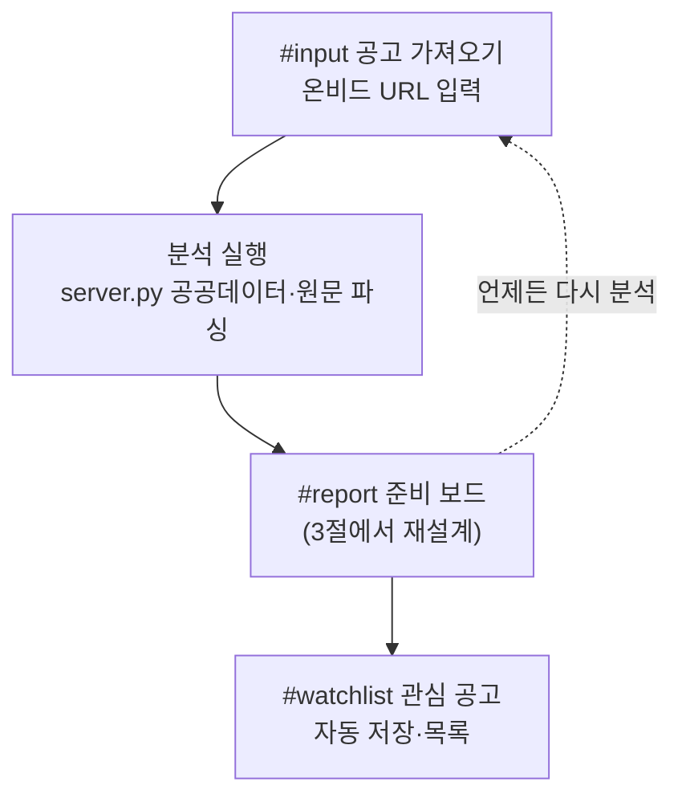
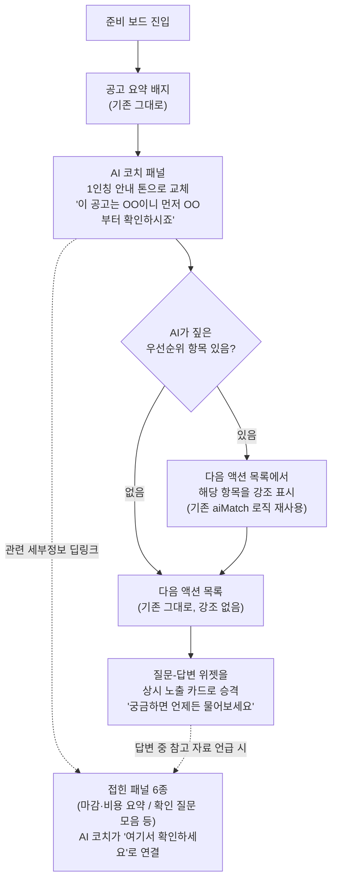

# AI 가이드형 UX 재설계 — 서비스 플로우

근거: `18_LLM질문답변_원가분석_요금제제안_20260921.md`(AI 코치·질문답변 현황), 2026-09-30 대화(옵션 B 확정)
작성: 2026-10-01

---

## 1. 방향 확인 [관측]

동원님이 확정한 방향은 옵션 B다.

- 기능·판단 로직은 바꾸지 않는다.
- 화면의 태도만 "정보 나열"에서 "AI가 순서대로 안내"로 바꾼다.
- 제출한 사업계획서의 "판단하지 않는다" 약속과 캠코 멘토링 M4("밸리데이션으로 만들면 안 된다")는 그대로 지킨다.

이 문서는 구현 전 검토용 플로우 다이어그램이다. 코드는 아직 건드리지 않았다.

## 2. 전체 화면 흐름 (변화 없음)

화면 3개(공고 가져오기 → 준비 보드 → 관심 공고) 구조 자체는 바뀌지 않는다. 바뀌는 자리는 준비 보드 **안**의 안내 방식이다.

## 3. 준비 보드 내부 안내 흐름 (신규)

지금은 AI 코치 패널·다음 액션·서류 체크리스트·접힌 패널 6개가 **병렬로 나열**되어 있고, 질문-답변 위젯은 코치 패널 안에 묻혀 있다. 사용자가 전부 훑어야 한다.

바꾸는 방향은 AI 코치가 **먼저 말을 걸고 순서를 짚어 주는** 흐름이다.

## 4. 기존 대비 변경 요약

- AI 코치 패널 문구: 명사형 나열 → 1인칭 안내 톤. **문구만 교체**, 판단 로직 변경 없음.
- 다음 액션 목록: 이미 있는 `aiMatch`(AI 우선순위 매칭) 로직을 시각적으로만 더 강조. 새 판단 로직 추가 없음.
- 질문-답변 위젯: 코치 패널 하단에서 독립 카드로 승격. 기존 `/api/ask` 호출 그대로 재사용.
- 접힌 패널 6종: 코드·구조는 그대로 두고, 코치 패널이 관련 패널로 안내 링크만 추가.

전부 **표시 순서·강조·문구** 변경이고, 추출·분석·체크리스트 판정 로직은 손대지 않는다.

## 5. 범위 밖 (이번에 안 건드림)

- `local_ai_coach`의 판정 기준, API 호출 경로, 체크리스트 상태 계산 로직.
- 색상 팔레트·기본 폰트·서류명 타이포그래피(이미 확정, 2026-09-21~22 반영).
- 계정시스템·결제모듈(마일스톤 2 별도 항목).

## 6. 다음 단계

이 플로우로 진행해도 될지 확인받은 뒤, UX 흐름 감사자·비주얼 디자이너를 3팀으로 불러 세부 문구·레이아웃을 검증하고 구현한다.
